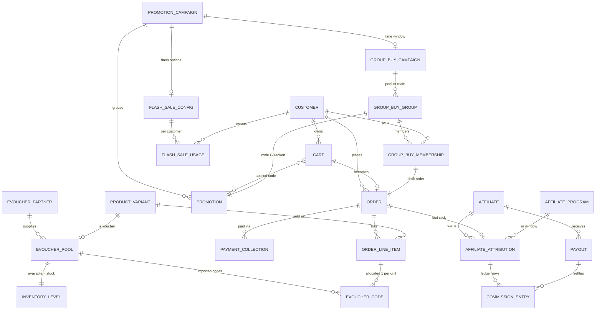

# ERD

UPPERCASE boxes without a module prefix are Medusa core entities. Links to core entities use `defineLink`.

```mermaid
erDiagram
  CUSTOMER ||--o{ CART : owns
  CUSTOMER ||--o{ ORDER : places
  CART ||--o| ORDER : becomes
  ORDER ||--o{ ORDER_LINE_ITEM : has
  PRODUCT_VARIANT ||--o{ ORDER_LINE_ITEM : "sold as"
  PROMOTION_CAMPAIGN ||--o{ PROMOTION : groups
  CART }o--o{ PROMOTION : "applied code"
  ORDER ||--o{ PAYMENT_COLLECTION : "paid via"

  EVOUCHER_PARTNER ||--o{ EVOUCHER_POOL : supplies
  PRODUCT_VARIANT ||--o| EVOUCHER_POOL : "is voucher"
  EVOUCHER_POOL ||--o{ EVOUCHER_CODE : "imported codes"
  ORDER_LINE_ITEM ||--o{ EVOUCHER_CODE : "allocated 1 per unit"
  EVOUCHER_POOL ||--|| INVENTORY_LEVEL : "available = stock"

  PROMOTION_CAMPAIGN ||--o| FLASH_SALE_CONFIG : "flash options"
  FLASH_SALE_CONFIG ||--o{ FLASH_SALE_USAGE : "per customer"
  CUSTOMER ||--o{ FLASH_SALE_USAGE : counts

  PROMOTION_CAMPAIGN ||--o| GROUP_BUY_CAMPAIGN : "time window"
  GROUP_BUY_CAMPAIGN ||--o{ GROUP_BUY_GROUP : "pool or team"
  GROUP_BUY_GROUP ||--|| PROMOTION : "code GB-token"
  GROUP_BUY_GROUP ||--o{ GROUP_BUY_MEMBERSHIP : members
  CUSTOMER ||--o{ GROUP_BUY_MEMBERSHIP : joins
  GROUP_BUY_MEMBERSHIP ||--|| ORDER : "draft order"

  AFFILIATE ||--o{ AFFILIATE_ATTRIBUTION : earns
  ORDER ||--o| AFFILIATE_ATTRIBUTION : "last click"
  AFFILIATE_PROGRAM ||--o{ AFFILIATE_ATTRIBUTION : "in window"
  AFFILIATE_ATTRIBUTION ||--o{ COMMISSION_ENTRY : "ledger rows"
  AFFILIATE ||--o{ PAYOUT : receives
  PAYOUT ||--o{ COMMISSION_ENTRY : settles
```
