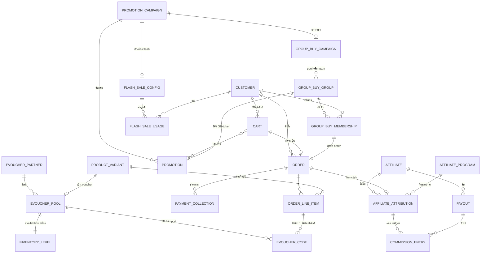

# ERD

กล่องตัวพิมพ์ใหญ่ที่ไม่มี prefix ของ module คือ entity หลักของ Medusa การเชื่อมไปยัง entity หลักใช้ `defineLink`

```mermaid
erDiagram
  CUSTOMER ||--o{ CART : "เป็นเจ้าของ"
  CUSTOMER ||--o{ ORDER : "สั่งซื้อ"
  CART ||--o| ORDER : "กลายเป็น"
  ORDER ||--o{ ORDER_LINE_ITEM : "มี"
  PRODUCT_VARIANT ||--o{ ORDER_LINE_ITEM : "ขายในรูป"
  PROMOTION_CAMPAIGN ||--o{ PROMOTION : "จัดกลุ่ม"
  CART }o--o{ PROMOTION : "โค้ดที่ใช้"
  ORDER ||--o{ PAYMENT_COLLECTION : "ชำระผ่าน"

  EVOUCHER_PARTNER ||--o{ EVOUCHER_POOL : "จัดหา"
  PRODUCT_VARIANT ||--o| EVOUCHER_POOL : "เป็น voucher"
  EVOUCHER_POOL ||--o{ EVOUCHER_CODE : "โค้ดที่ import"
  ORDER_LINE_ITEM ||--o{ EVOUCHER_CODE : "จัดสรร 1 โค้ดต่อหน่วย"
  EVOUCHER_POOL ||--|| INVENTORY_LEVEL : "available = สต็อก"

  PROMOTION_CAMPAIGN ||--o| FLASH_SALE_CONFIG : "ตัวเลือก flash"
  FLASH_SALE_CONFIG ||--o{ FLASH_SALE_USAGE : "ต่อลูกค้า"
  CUSTOMER ||--o{ FLASH_SALE_USAGE : "นับ"

  PROMOTION_CAMPAIGN ||--o| GROUP_BUY_CAMPAIGN : "ช่วงเวลา"
  GROUP_BUY_CAMPAIGN ||--o{ GROUP_BUY_GROUP : "pool หรือ team"
  GROUP_BUY_GROUP ||--|| PROMOTION : "โค้ด GB-token"
  GROUP_BUY_GROUP ||--o{ GROUP_BUY_MEMBERSHIP : "สมาชิก"
  CUSTOMER ||--o{ GROUP_BUY_MEMBERSHIP : "เข้าร่วม"
  GROUP_BUY_MEMBERSHIP ||--|| ORDER : "draft order"

  AFFILIATE ||--o{ AFFILIATE_ATTRIBUTION : "ได้รับ"
  ORDER ||--o| AFFILIATE_ATTRIBUTION : "last click"
  AFFILIATE_PROGRAM ||--o{ AFFILIATE_ATTRIBUTION : "ในช่วงเวลา"
  AFFILIATE_ATTRIBUTION ||--o{ COMMISSION_ENTRY : "แถว ledger"
  AFFILIATE ||--o{ PAYOUT : "รับ"
  PAYOUT ||--o{ COMMISSION_ENTRY : "ชำระ"
```
